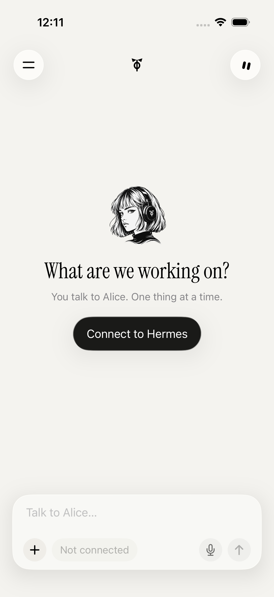
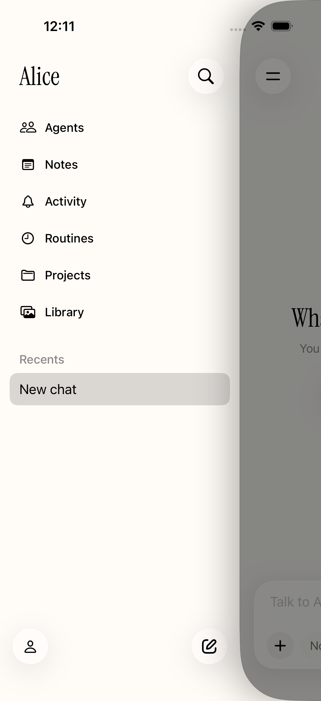
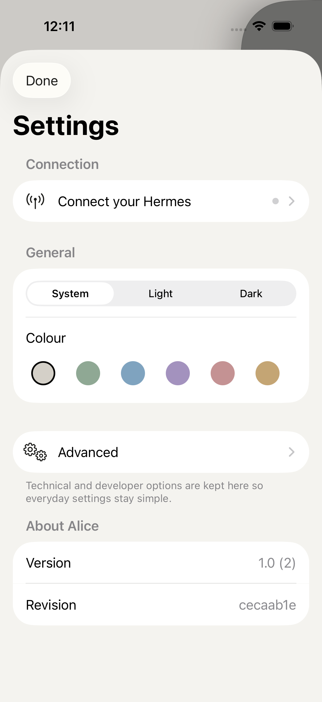

<div align="center">

# Alice

**Your Hermes. In your pocket.**

A native iPhone app for talking to and managing your own
[Hermes agent](https://hermes-agent.nousresearch.com).

[](https://github.com/Freixanet/alice/actions/workflows/quality.yml)
[](LICENSE)

[Connect your Hermes](docs/getting-connected.md) · [Build the app](ios/README.md) · [Contribute](CONTRIBUTING.md)

</div>

<table>
<tr>
<td width="33%"><br><sub>Start with your own Hermes.</sub></td>
<td width="33%"><br><sub>Everyday work, within reach.</sub></td>
<td width="33%"><br><sub>Connection and preferences.</sub></td>
</tr>
</table>

<sub>Actual iOS simulator captures, before connecting an agent.</sub>

## An interface for the agent you already own

Alice brings conversations, agents, routines and everyday work into a native
SwiftUI app. Your Hermes runs on your own computer or server; Alice connects
to it. You keep control of its models, tools and integrations.

The **iOS app is the primary product**. The repository also includes a web
companion, a Hermes dashboard plugin for pairing and an optional Mac notifier.
Alice is an independent project, not an official Nous Research product.

## Start on iPhone

1. Install a build of Alice using the [iOS build instructions](ios/README.md).
2. Keep your configured Hermes running on a reachable computer or server.
3. Open **Connect** in Alice. Enter the Hermes address and key, or scan a
   pairing QR if the Alice plugin is on the dashboard.

The current QR setup uses the included [dashboard plugin](hermes-plugin/README.md)
(`hermes-plugin/install.sh`). A Mac and Tailscale are typical; they are not
required for a manual connection. An administrator must prepare that
installation first. Alice does not install Hermes or provide a model
subscription.

**[Guía de conexión en español →](docs/getting-connected.md)**

The iOS app is English by default, with Spanish as a second language. The
phone's language setting chooses which one you see.

## What you can do

- **Converse:** streaming replies, tool activity, Markdown, attachments and model selection.
- **Work with agents:** agent-specific conversations and canonical Hermes sessions. A sentence is enough to create one; Alice opens that agent so it can ask anything it still needs.
- **Organize:** conversation history, pinned chats, projects, library and notes where supported.
- **Share into chat:** the iOS share sheet hands Alice a paragraph or a link as a draft. You send it.
- **Run routines:** manage scheduled work and review activity.
- **Keep an eye on pages:** set a price, stock, text or change watch in Settings → Agent work. The optional watcher runs on your Hermes Mac.
- **Work with files and a shared browser:** give agents a PDF or bank statement, or watch and control their browser from Settings → Agent work. These require the Alice dashboard plugin.
- **Configure:** everyday settings first; models, skills and Hermes administration one level deeper.

Availability depends on your Hermes installation and its management endpoints.
Chat and dashboard connections are separate. The
[compatibility matrix](docs/compatibility-matrix.md) documents differences between
surfaces, optional dependencies and checks still required before release.

## Inside the repository

| Surface                            | Stack                                  | Role                                       |
| ---------------------------------- | -------------------------------------- | ------------------------------------------ |
| [`ios/`](ios/)                     | SwiftUI · iOS 26 · Keychain            | Primary native app                         |
| [`src/`](src/)                     | React 19 · TanStack Start · TypeScript | Web companion, direct and proxy transports |
| [`hermes-plugin/`](hermes-plugin/) | Python · Hermes dashboard              | Pairing, memory and notes integration      |
| [`mac/notifier/`](mac/notifier/)   | Python · macOS                         | Optional host notifications                |

The [architecture guide](docs/architecture.md) explains identity, storage and
transport boundaries. [AGENTS.md](AGENTS.md) is the shared working contract for
human contributors and coding tools; Claude Code and Cursor instructions point
to it. The repository carries its own context so work can move between tools.

## Develop

### Native app

On macOS with Xcode, an iOS 26 simulator runtime and XcodeGen:

```bash
git clone https://github.com/Freixanet/alice.git
cd alice
bash scripts/verify-ios.sh all
```

The script generates the Xcode project and runs unit and UI tests in a dedicated
simulator. Open `ios/Alice.xcodeproj` to develop or configure device signing.
See [iOS setup](ios/README.md) for details.

### Web companion

Use Node 22.13+ in the 22.x line or Node 24+, and npm 11.19.0.

```bash
cp .env.example .env
# Set the secrets described in .env.example before using real credentials.
npm ci
npm run dev
```

Open the local URL printed by Vite (port 8080 by default). Local accounts use an
in-memory database unless `ALICE_PGLITE_DIR` points to a dedicated writable
directory. Keep stable authentication and cookie secrets for persistent use.
Production requires Postgres, enabled authentication and a stable
`BETTER_AUTH_SECRET` of at least 32 characters; invalid configuration stops startup.

## Trust and privacy

| Connection | Where its credentials are handled                                                                       |
| ---------- | ------------------------------------------------------------------------------------------------------- |
| iPhone     | Device-only Keychain, accessible while the device is unlocked                                           |
| Web proxy  | Browser connection form, then server and encrypted `httpOnly` cookie                                    |
| Direct web | Account-scoped session storage and JavaScript memory; authenticated recovery from the connection cookie |
| Local web  | User-entered key may be held in JavaScript memory; server access is owner-restricted                    |

Connection forms and QR exchanges necessarily handle readable credentials.
Keys are not stored in `localStorage` or intentionally logged. Hermes retains
the authority of the agent you configured. Read [SECURITY.md](SECURITY.md) for
boundaries and private vulnerability reporting.

## Quality and compatibility

Native tests cover contracts, state and UI journeys. Web checks cover types,
unit and contract tests, accessibility, visual regression, browser behavior and
bundle budgets. CI also checks Python integrations and scans for secrets.

```bash
bash scripts/verify-ios.sh all
npm run check
npm run security:check
npm run deps:check
```

Read the [verification guide](docs/verification.md) for prerequisites and what
each suite proves. Browser fixtures do not prove production account recovery;
simulator tests do not replace physical-device pairing and background tests.

Hermes contracts are checked against versioned official sources, including
0.21.3. [The Hermes contract checklist](docs/hermes-contracts.md) records what was checked.
New Hermes releases require a compatibility review; a green badge does not
establish universal or future compatibility.

## Contribute

Start with [CONTRIBUTING.md](CONTRIBUTING.md). Describe the user's problem,
preserve connection and data contracts, and include reproducible verification.
Please keep credentials and private conversations out of issues and screenshots.

[MIT](LICENSE) © Marc Freixanet
