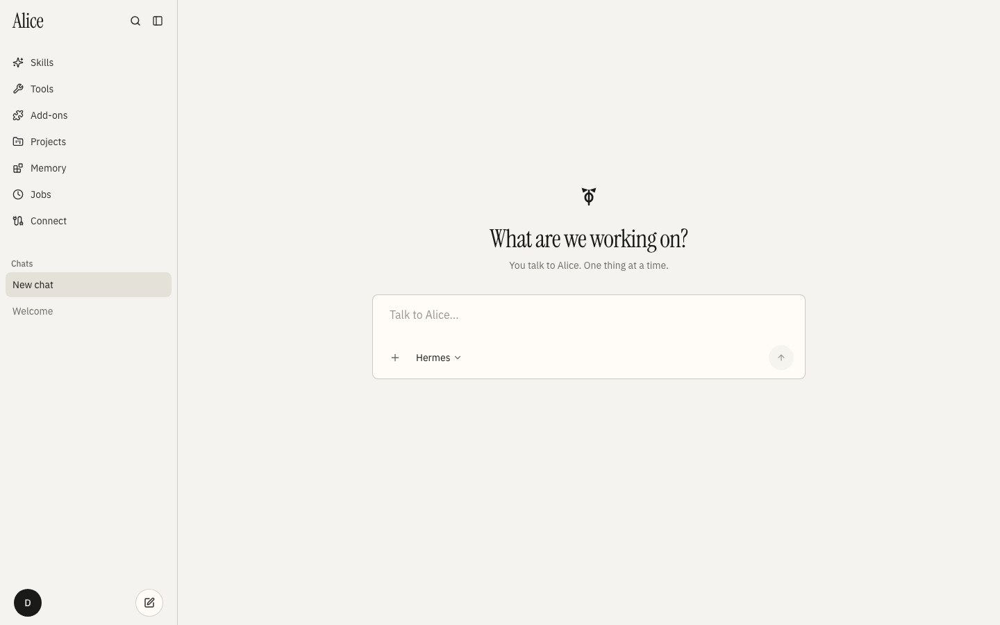
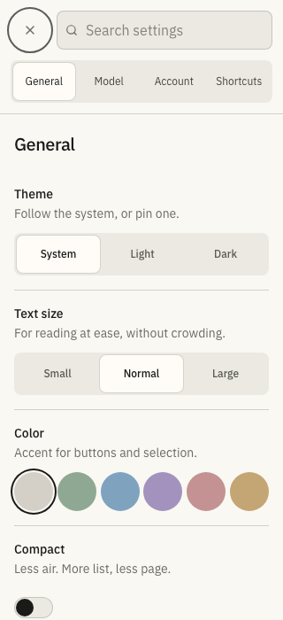

<div align="center">

# Alice

**A calm interface for your own [Hermes](https://hermes-agent.nousresearch.com) agent.**

Your agent's key never enters this repository, never reaches the page,
and never leaves the machine you put it on.

[](https://github.com/Freixanet/alice/actions/workflows/quality.yml)
[](LICENSE)



</div>

---

## What this is

Hermes is an agent that reads your files, runs commands and spends money under
your account. Most front ends for something like that ask you to paste a key
into a text box and hope. Alice is built the other way round: the key is the
asset, and every design decision protects it.

It talks to **your** Hermes — on your Mac, on a server, or across a Tailscale
network — and adapts to whatever that particular build can do.

## Quickstart

```bash
git clone https://github.com/Freixanet/alice.git && cd alice
cp .env.example .env      # set HERMES_COOKIE_SECRET to a long random value
npm install
npm run dev
```

Open the app, go to **Connect**, and paste the address and key of your own
Hermes. Nothing else is configured for you, and no key ships with the code.

Alice defaults to port 8080 and works on any free port if that one is taken.

## How the key is handled

| Deployment                   | Storage                                            | Readable by the page |
| ---------------------------- | -------------------------------------------------- | -------------------- |
| Server (Vercel, self-hosted) | Encrypted `httpOnly` cookie, decrypted per request | No                   |
| Same machine as the agent    | Process memory, for the lifetime of the tab        | No                   |

It is never written to `localStorage`, never rendered into the DOM, never
logged, and never echoed back by an API response — including on errors. See
[SECURITY.md](SECURITY.md) for the full threat model.

## Capability negotiation

Hermes builds differ. Rather than assume a feature exists, Alice asks.

`/v1/capabilities` describes the _agent_ API — chat, runs, sessions, models.
Profiles, analytics, cron, MCP and webhooks live on a separate _management_
surface under `/api/*`, and nothing requires a build to describe one in the
other. So when the manifest is silent about one of those, Alice probes the
endpoint itself: only a `2xx` counts as support, a redirect means a login wall,
and a failure leaves the manifest untouched.

The result is that a page appears when your Hermes can actually serve it, and
explains what is missing when it cannot — the same way behind Tailscale, a
reverse proxy, a cloud host, or on the same machine.

## Knowing why a model call failed

Hermes folds every upstream `429` into a generic rate limit and drops the
provider's `error.type` before the error arrives, so "you are out of quota" and
"slow down" look identical by the time they reach a UI.

Alice classifies from what survives — the HTTP status, `Retry-After`, and the
provider text — and tells you whether waiting helps. A spent subscription
allowance says so; a passing rate limit says when to retry.

## Architecture

|            |                                                                             |
| ---------- | --------------------------------------------------------------------------- |
| Framework  | TanStack Start (React 19, Vite)                                             |
| Language   | TypeScript, `exactOptionalPropertyTypes` on external contracts              |
| State      | Zustand, persisted per account                                              |
| Data       | Postgres in production, in-memory PGlite for local dev                      |
| Auth       | Better Auth — email/password, Google, Apple                                 |
| Transports | Authenticated server proxy **and** direct browser-to-Hermes, kept at parity |

Deeper notes live in [`docs/`](docs/): the
[request lifecycle](docs/request-lifecycle.md),
[chat virtualization](docs/chat-virtualization.md),
[type-safety ratchet](docs/type-safety.md),
[operational telemetry](docs/operational-telemetry.md) and
[release operations](docs/release-operations.md).
[`HERMES_PANTHEON.md`](HERMES_PANTHEON.md) tracks compatibility with each
Hermes release.

## Quality gates

`npm run check` has to pass before anything ships. It runs, in order:

| Gate                                        | What it protects                                                                 |
| ------------------------------------------- | -------------------------------------------------------------------------------- |
| `format:check`, `lint`                      | Style, with zero warnings tolerated                                              |
| `typecheck`, `typecheck:contracts`          | Types, and a stricter pass over external contracts                               |
| `test`, `test:coverage`                     | ~300 unit and contract tests                                                     |
| `cycles:check`                              | No circular imports                                                              |
| `duplicates:check`                          | Copy-paste threshold                                                             |
| `design:check`                              | No `!important`, shadows, gradients or backdrop filters                          |
| `build:ci`, `bundle:smoke`, `bundles:check` | Production build, server bundle boot, size budgets                               |
| `test:e2e`                                  | ~80 Playwright tests across Chromium, Firefox and WebKit, plus visual regression |

CI runs the same work on every push, split across two runners so the browser
suite runs in parallel, and adds `gitleaks` over the full history,
`npm audit --audit-level=high` and an unused-dependency check.

## Accessibility and reach

`axe-core` runs against the app on every push and fails the build on any
critical or serious violation, and a separate test asserts that interactive
targets on mobile are at least 44px. The slash-command menu carries listbox
semantics and moves under the arrow keys.

The interface ships complete in English and Spanish. Parity is not a convention
here: the Spanish catalogue is typed as `Record<MsgKey, string>`, so a missing
translation is a compile error rather than a blank label in production. Light
and dark follow your system preference by default.

<div align="center">

</div>

## Deploying

The app is Vercel-ready. Set `HERMES_COOKIE_SECRET`, `DATABASE_URL` and
`BETTER_AUTH_URL`; `.env.example` documents the optional owner and Google
variables. `npm run release:verify` checks a build before you promote it.

## License

[MIT](LICENSE) © Marc Freixanet
